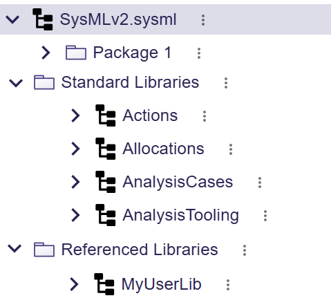

= Improve support for libraries in the explorer

== Problem

All the libraries are displayed at the root of the project.

There is no easy way for the user to differentiate standard libraries from user-imported libraries. 

It is not possible to hide imported libraries from the explorer (only standard SysML and KerML libraries can be hidden)

It is possible to delete standard libraries from the explorer.

== Key Result

Users should be able to easily differentiate standard libraries from user-imported libraries.

Users should be able to import libraries.

Users should be able to hide libraries.

Users should be able to delete user-imported libraries.

Users should *not* be able to delete standard libraries.

== Solution

The explorer contains two directories to differentiate the kind of libraries used in the project: `Standard Libraries` and `Referenced Libraries`.

_Standard Libraries_ are defined as models containing a single top-level `LibraryPackage` with the `isStandard` attribute set to `true`.
_Referenced Libraries_ are defined as any imported SysML model containing a single top-level `LibraryPackage` with `isStandard` attribute set to `false`.

KerML and SysML libraries are displayed in the `Standard Libraries` directory.

The contextual menu on standard libraries does not provide a delete action.

User-imported libraries are displayed in the `Referenced Libraries` directory.

The contextual menu on user-imported libraries provides a delete action.

It is not possible to import a _Standard Library_: these libraries are already available in any SysON project, and these libraries are the only one that can be standard in the context of SysMLv2.
In particular, the `Standard Libraries` directory doesn't provide an action to import a library, and it is not possible to delete a _Standard Library_ from the explorer.

=== Scenario

1. User creates a new project
- The SysML model is the first element in the explorer
- The explorer contains a `Standard Libraries` directory containing the KerML and SysML libraries
- The explorer contains an empty `Referenced Libraries` directory

2. User imports a referenced library from the explorer toolbar
- The user clicks on the _Upload Model_ tool in the explorer toolbar
- The user selects a SysML model that contains a top-level `LibraryPackage` with `isStandard=false` to import and presses _Upload_
- The model is imported and displayed in the `Referenced Libraries` directory

3. User imports a standard library from the explorer toolbar
- The user clicks on the _Upload Model_ tool in the explorer toolbar
- The user selects a SysML model that contains a top-level `LibraryPackage` with `isStandard=true` and presses _Upload_
- An error is displayed telling the user that standard libraries cannot be imported in SysON.

=== Cutting backs

Nothing identified.

== Rabbit holes

Nothing identified.

== No-gos

- Library publication: libraries can only be imported via the textual import already implemented in SysON: any other way to make a library accessible to other users (e.g. by storing it in a dedicated database table) is out of the scope of this work.
- Duplicated import management: importing a library that is already imported creates a new model representing the library (current behavior in SysON).
- Fine-grained management of _Referenced Library_ deletion: deleting a library deletes all the references to elements of this library.
- The versionning of libraries is out of the scope of this work.