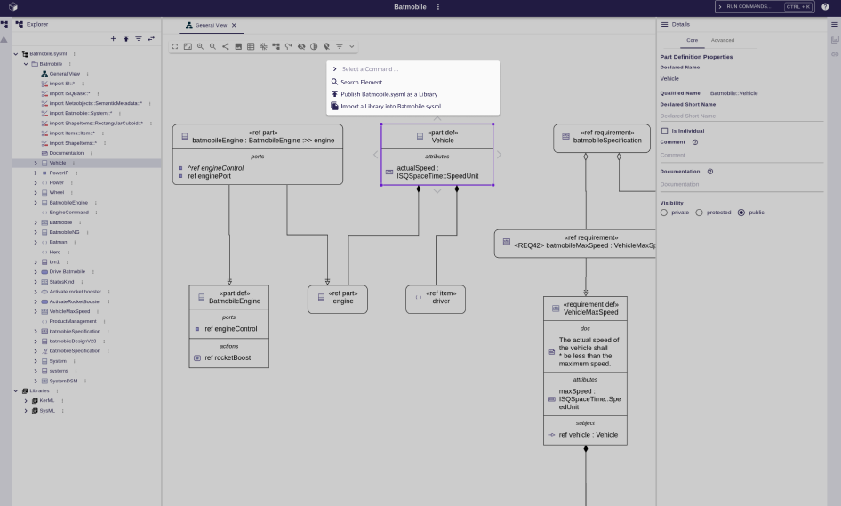
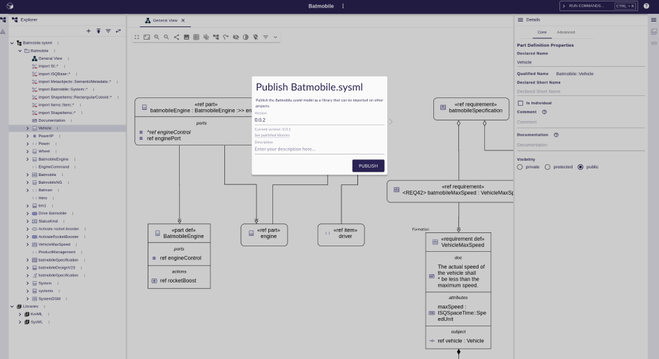

= Add support for library publication

== Problem

SysON doesn't provide an  **in-application** way to import models from other projects.
The current import/export mechanisms rely on generating a textual SysML file, and uploading such file in a project to import it.

When exported models are used as shared reusable components, it is the responsibility of the stakeholders to:
- Store the shared models in an external location
- Ensure that every user is working on the same version of the shared model
- Coordinate to export a new version when needed, and import it in all the dependent projects

These processes are error-prone, and could be more controlled if they all happened inside the application.

== Key Result

SysON users should be able to:

- Publish a library with a given version number and description
- See published libraries

== Solution

The command palette provides a command to publish libraries from the current project.
This command opens a dialog asking the user to provide the version and the description of the library they want to publish.

The publication process creates a single, self-contained library containing all the SysML models stored in the current project.
The library name is set with the name of the current project.
Note that the created library does not contain the SysML and KerML Standard library models since they are automatically imported in every SysML project.

It is not possible to publish a library with the same projectId/name/version as an existing library (this constraint is enforced by Sirius Web).

A page containing a table presenting all the libraries published on the server is accessible at the `<syson_url>/libraries` URL. This page can also be accessed via a button in the top-right menu of the navigation bar. 

=== Scenario

1. User publishes a library from their project
- The user creates a new project
- The user creates SysML elements in the project
- The user opens the command palette and selects the publish command
- The user fills requested information in the dialog (version number, comment, etc) and presses _Publish_
- A message is displayed indicating that the publication was successful
- The user can navigate to `/libraries` to view the library published by the project

2. User tries to publish a library with an existing version
- The user creates a new project with SysML elements inside it
- The user publishes a library with version `X` from the project (see scenario 1)
- The user publishes again a library with version `X` from the project
- An error message is displayed indicating that the library with the given version already exists

=== Breadboarding

Publish project command in the command palette

Publication dialog prompting the user to enter a version and description

- The _See published libraries_ link opens a page in a new tab containing the list of published libraries on the server.

Libraries page showing all the published libraries in the server

image:images/add_support_for_library_publication_03.png[Libraries page showing all the published libraries in the server]

=== Cutting backs
- (Nice to have) The current published version of a model is displayed in the explorer next to its name.

== Rabbit holes

== No-gos

This shape doesn't address the issue of importing a published model.
This will be done in a future shape.