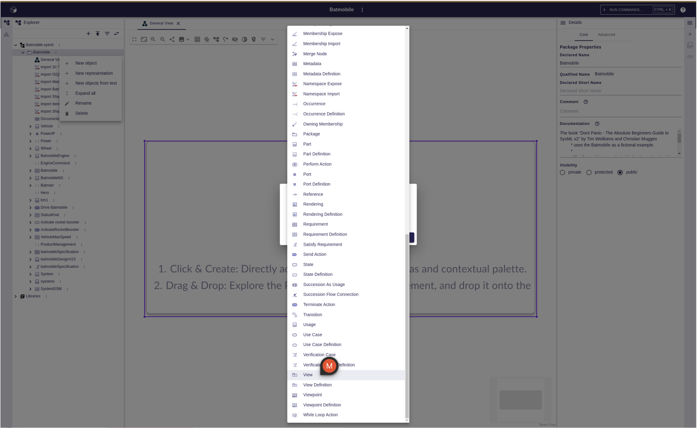
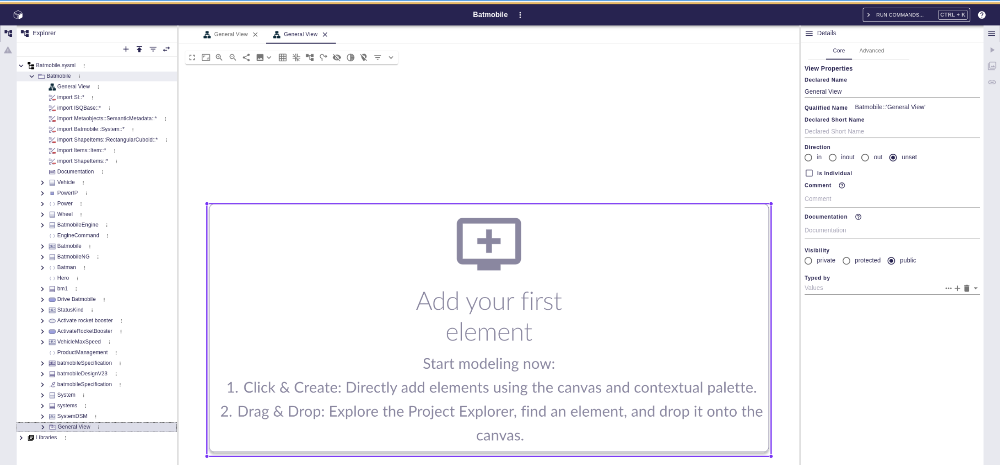
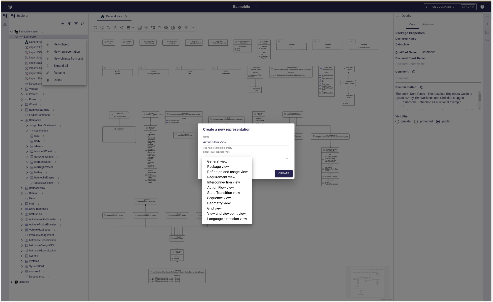

= Diagrams on ViewUsages

The parent shape of this is link:./add_support_for_viewusages.adoc[Add support for ViewUsages].

== Problem

With the current version 2025.4.0 of SysON, diagrams (GV, IV) are attached to semantic objects like Packages, Parts, Actions...

In the SysMLv2 specification, the ViewDefinition concept allows to define how to render elements (textual, graphical...) and `ViewUsage` is an instance of a ViewDefinition.

== Key Result

To comply with the specification, SysON should use `ViewUsages` and `ViewDefinitions` to handle diagrams.
When end-users click on _New Representation_ on a semantic element, then _DiagramDescriptions_ are proposed in the list of representations, as of the current version.
Then end-users click on _CREATE_ button, a `ViewUsage` is created, typed with the `ViewDefinition` corresponding to the selected _DiagramDescription_.

Then, no diagram tree item is created/visible under this `ViewUsage`.
When end-users click on this `ViewUsage`, the diagram is opened.

In the _Details_ view, it will not be possible to change the type of a `ViewUsage` for now.
In the _Details_ view, when a `ViewUsage` is selected, two tabs are displayed: one for the semantic element, and one for the representation.
The tab for the representation will be read-only.

There will be only one _Diagram_ per `ViewUsage`.

When end-users click on _New Object_ on a semantic element, and select a `ViewUsage`, then a `ViewUsage` typed by default with the _General View_ `ViewDefinition` from the standard library will be created.
A _General View_ diagram will also be created as well.

== Solution

=== Breadboarding

When end-users click on New Object menu, `ViewUsages` are available:

Once the `ViewUsage` created, its is displayed in the _Explorer_ view:

When end-users click on New representation menu, `ViewDefinitions` (or _DiagramDescriptions_?) are available:

=== Cutting backs

When a `ViewUsage` is renamed, the associated representation will not be  renamed as well.

== Rabbit holes

No rabbit holes found.

== No-gos

N/A