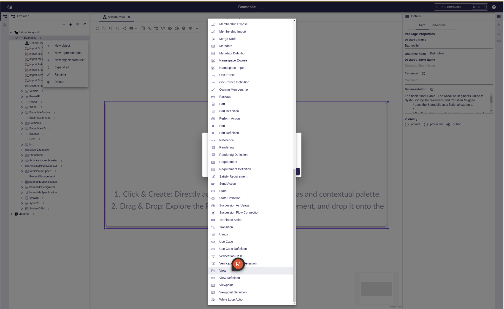
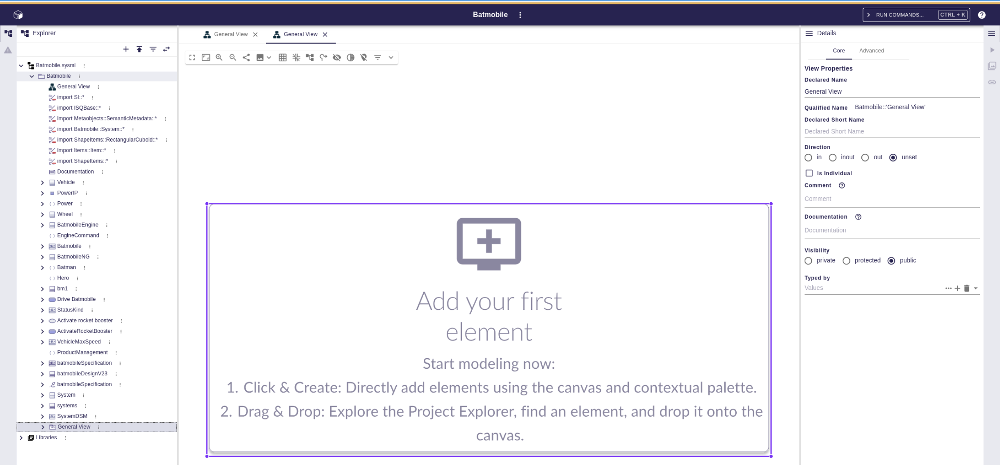
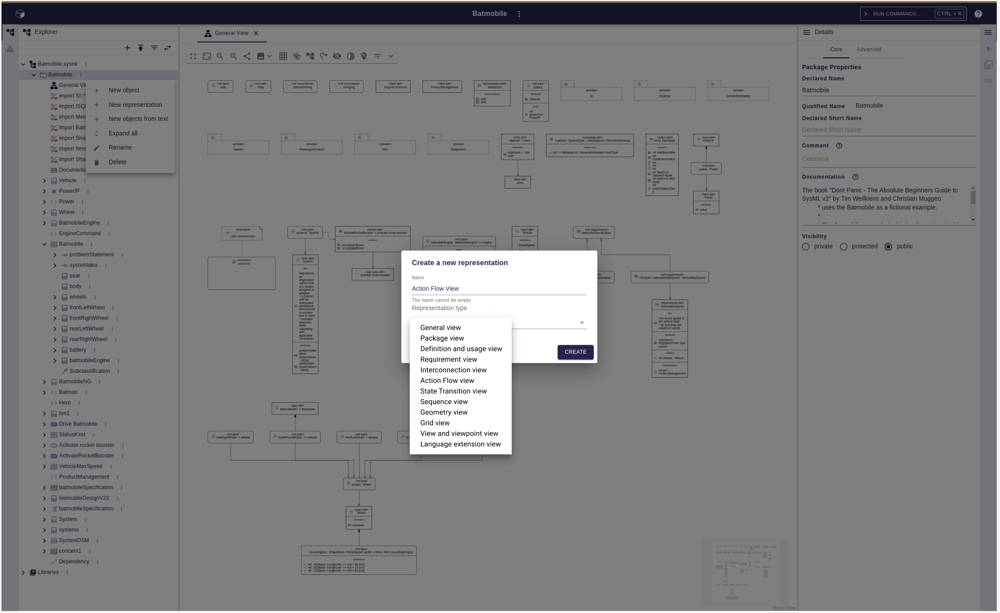

= Diagrams on ViewUsages

== Problem

With the current version 2025.04 of SysON, diagrams (GV, IV) are attached to semantic objects like Packages, Parts, Actions...

In the SysMLv2 specification, the ViewDefinition concept allows to define how to render elements (textual, graphical...) and ViewUsage is an instance of a ViewDefinition.

== Key Result

To comply with the specification, SysON should use ViewUsages and ViewDefinitions to handle diagrams.
When end-users click on _New Representation_ on a semantic element, then DiagramDescription are proposed in the list of representations, as of the current version.
Then end-users click on _CREATE_ button, a ViewUsage is created, typed with the ViewDefinition corresponding to the selected DiagramDescription.

Then, a choice must be made:

1) A Sirius-Web diagram is created under this ViewUsage.
When the diagram is renamed, the ViewUsage is also renamed (and vice-versa).
Same for the deletion.

2) No diagram tree item is created/visible under this ViewUsage.
When end-users click on this ViewUsage, the diagram is opened.

In the _Details_ view, it will not be possible to change the type of a ViewUsage for now.

There are no FormView in the `StandardViewDefinitions.sysml` library.
So when end-users of downstream applications will try to create Sirius representations like Forms that don't exist in SysMLv2 standard libraries, then , a choice must be made:

1) no ViewUsage is created.
A Sirius-Web diagram is created under the selected semantic element.

2) a ViewUsage is created.
A non-standard library must exists containing a compliant ViewDefinition.
The ViewUsage is then typed with this non-standard ViewDefinition.

== Solution

=== Breadboarding

When end-users click on New Object menu, ViewUsages are available:

Once the ViewUsage created, its is displayed in the _Explorer_ view:

When end-users click on New representation menu, ViewDefinitions (or DiagramDescriptions?) are available:

=== Cutting backs

Depends on the choices

== Rabbit holes

No rabbit holes found.

== No-gos

N/A