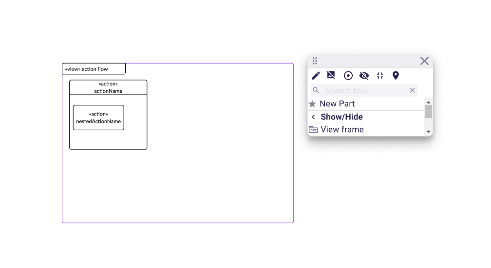
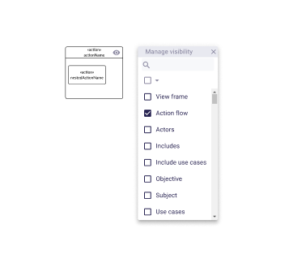

= Display ViewUsages in Diagrams

The parent shape of this is link:./add_support_for_viewusages.adoc[Add support for ViewUsages].

== Problem

With the current version 2025.4.0 of SysON, it is not possible to display `ViewUsage` elements in diagrams.

== Key Result

`ViewUsage` elements are now displayed in diagrams.
They should be represented as "framed view", as described in _8.2.3.26 Views and Viewpoints Graphical Notation_ of the SysMLv2 specification.

A `ViewUsage` diagram element has the same palette than background palette of diagram that would have been created on the semantic element containing the `ViewUsage`.

A new menu "Show/Hide > View frame" is available on a `ViewUsage`.
This menu allows to hide the framed view but not its contents.

When "Hide View frame" is clicked, the framed view is not on the diagram anymore and its contents are then moved into the original diagram.

It will be possible for end-users to reveal an hidden `ViewUsage` through:

* the _filter elements_ tool of the diagram toolbar.
* a graphical element who was previously inside the hidden framed view.
In this case, the "manage visibility" action will allow to reveal its hidden framed view.

== Solution

=== Breadboarding

The new menu item "Show View frame"/"Hide View frame" in "Show/Hide" section:

The new option "View frame" in "Manage Visibility" action dialog:

=== Cutting backs

_Renderings_, _filters_ and _satisfy_ properties of `ViewUsages` won't be taken into account for now.

== Rabbit holes

No rabbit holes found

== No-gos

N/A