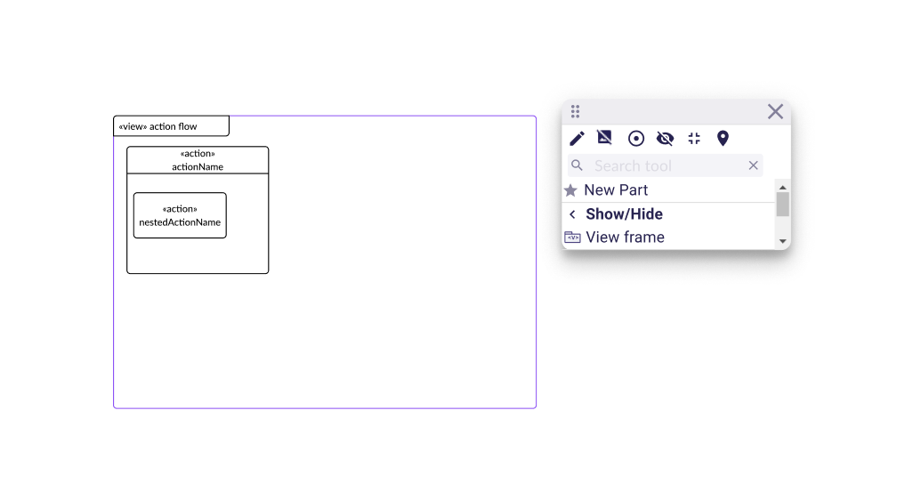

= Display ViewUsages in Diagrams

== Problem

With the current version 2025.04 of SysON, it is not possible to display diagrams in diagrams.

== Key Result

ViewUsage elements are now displayed in diagrams.
They should be represented as "framed view", as described in _8.2.3.26 Views and Viewpoints Graphical Notation_ of the SysMLv2 specification.

A ViewUsage diagram element has the same palette than background palette of diagram that would have been created on the semantic element containing the ViewUsage.

A new menu "Show/Hide > View frame" is available on a ViewUsage.
This menu allows to hide the framed view but not its contents.

Option 1:
When "Hide View frame" is clicked, the framed view is still on the diagram but its cartouche and its borders are hidden.
Its contents are still visible.

When "Show View frame" is clicked, the framed view is still on the diagram and its cartouche and its borders are revealed.
Its contents are still visible.

Option 2:
When "Hide View frame" is clicked, the framed view is not on the diagram anymore and its contents are then moved into the original diagram.
How will it be possible for end-users to know that a graphical element is then contained in a hidden framed view?

== Solution

=== Breadboarding

=== Cutting backs

Depends on the choices

== Rabbit holes

No rabbit holes found

== No-gos

N/A