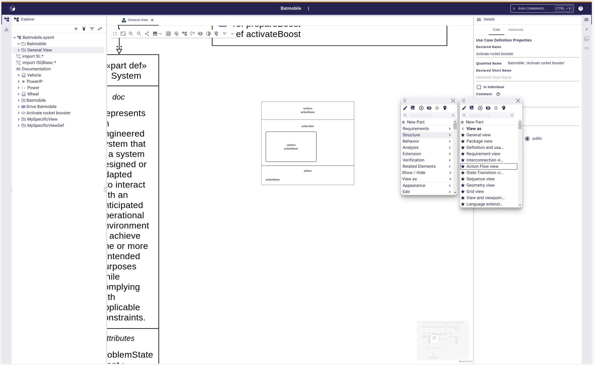

= Manage nested ViewUsages in Diagrams

== Problem

With the current version 2025.04 of SysON, it is not possible to display diagrams in diagrams.

== Key Result

=== On a diagram background?

A new menu _View As_ is available in the palette.
This menu allows to select a new kind of _Representation_ (i.e. ViewDefinitions).
When end-users click on a new kind of _Representation_, then the diagram updates itself?
What about the existing layout in case of a change from a "Interconnection" style to a "Tree" style?
What about a change from a diagram to a table/form...?

=== On a diagram element? 

A new menu _View As_ is available in the palette.
This menu allows to select a new kind of _Representation_ (i.e. ViewDefinitions).
When end-users click on a new kind of _Representation_, then a new ViewUsage element is created and typed with the selected ViewDefinition.
A _Representation_ is created and associated to this ViewUsage.
The selected diagram element on which the palette had been called, is now moved in the new _Representation_.
The ViewUsage is displayed in the original diagram.
A dedicated shape (i.e. Display View Usages In Diagrams) describes how ViewUsages are displayed in diagrams.

== Solution

=== Breadboarding

=== Cutting backs

Depends on the choices

== Rabbit holes

No rabbit holes found.

== No-gos

N/A