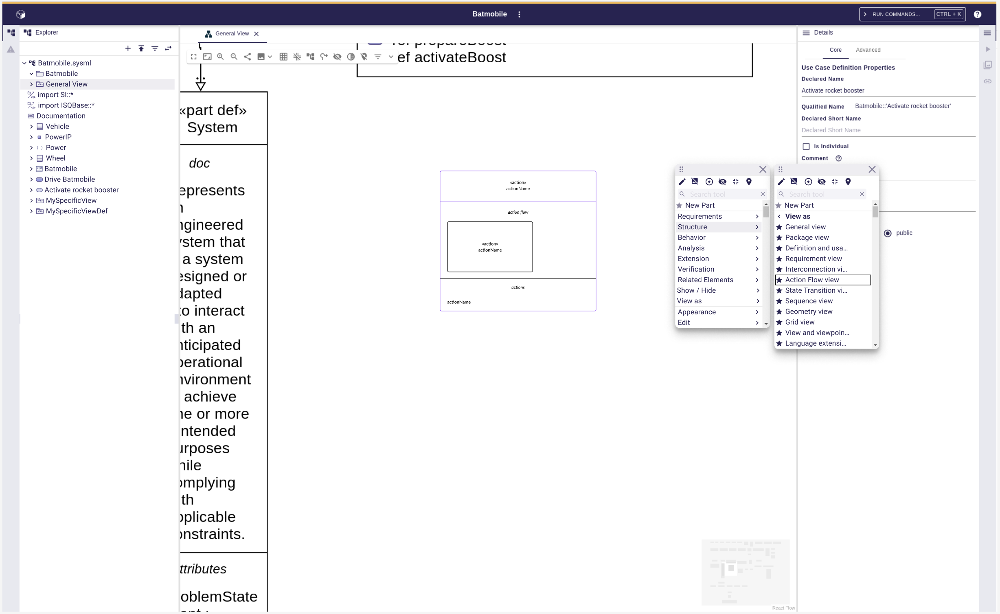

= Manage nested ViewUsages in Diagrams

The parent shape of this is link:./add_support_for_viewusages.adoc[Add support for ViewUsages].

== Problem

With the current version 2025.4.0 of SysON, it is not possible to display diagrams in diagrams.

== Key Result

=== On a diagram background

A new menu _View As_ (or _Appearance_, t.b.d) is available in the palette.
This menu allows to select a new kind of _Representation_ (i.e. `ViewDefinitions`).
When end-users click on a new kind of _Representation_, then the diagram updates itself.

=== On a ViewUsage diagram element

A new menu _View As_ (or _Appearance_, t.b.d) is available in the palette.
This menu allows to select a new kind of _Representation_ (i.e. `ViewDefinitions`).
When end-users click on a new kind of _Representation_, then a the existing `ViewUsage` element is now typed with the selected `ViewDefinition`.
The content of the `ViewUsage` is updated with the mappings corresponding to selected `ViewDefinition`.

=== On a diagram element that is not a ViewUsage

A new menu _View As_ (or _Appearance_, t.b.d) is available in the palette.
This menu allows to select a new kind of _Representation_ (i.e. `ViewDefinitions`).
When end-users click on a new kind of _Representation_, then a new `ViewUsage` element is created and typed with the selected `ViewDefinition`.
This new `ViewUsage` is created under the `ViewUsage` of the original diagram, or `ViewUsage` graphical container.
A _Representation_ is created and associated to this `ViewUsage`, but not opened.
The selected diagram element on which the palette had been called, is now moved in the new _Representation_.
The `ViewUsage` is displayed in the original diagram.
A dedicated shape (i.e. Display View Usages In Diagrams) describes how `ViewUsages` are displayed in diagrams.

== Solution

=== Breadboarding

The new menu allowing to change the appearance of o whole diagram, a single graphical element, or a selection of graphical elements:

=== Cutting backs

The existing layout will be lost in case of a change from a diagram style to another (e.g. "Interconnection" style to a "Tree" style).
It will not be possible to change from a kind of _Representation_ to another (e.g. a _Diagram_ to a _Form_).

== Rabbit holes

No rabbit holes found.

== No-gos

N/A