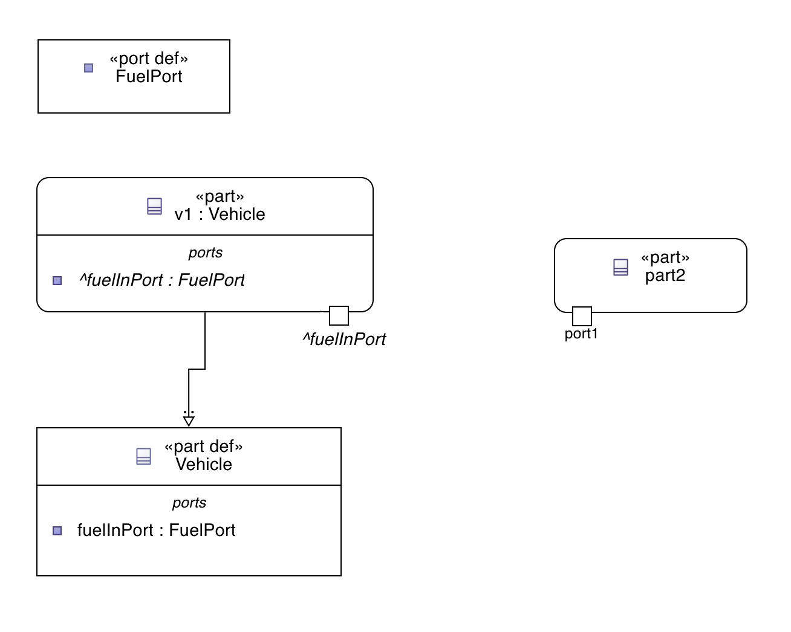
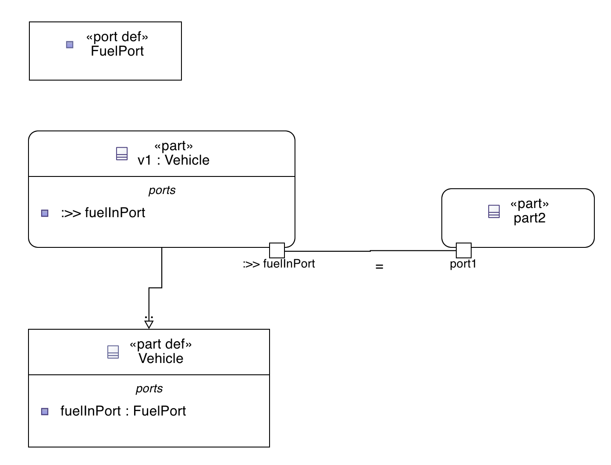

= Display inherited ports as border nodes in diagrams

== Problem

With the current version 2025.10.0 of SysON, inherited _PortUsages_ are displayed in the "ports" compartment in standard diagrams.

== Solution

The inherited _PortUsages_ are displayed as graphical border nodes in standard diagrams.

The existing diagram option "Show inherited members" should be used to control the visibility of inherited _PortUsages_ displayed as graphical border nodes (as they already do for the inherited _PortUsages_ displayed in the "ports" compartment).

The existing diagram option "Show inherited members from standard libraries" should be used to control the visibility of inherited _PortUsages_ from standard libraries displayed as graphical border nodes (as they already do for the inherited _PortUsages_ from standard libraries displayed in the "ports" compartment).

When an inherited _PortUsage_ is specialized, it should disappear from the graphical border nodes (as it is already the case for the "ports" compartment).
Instead, the specialized _PortUsage_ should be displayed as a graphical border node (as it is already the case for the "ports" compartment).

When a _PortUsage_ is inherited from multiple super types, it should be displayed only once as a graphical border node (as it is already the case for the "ports" compartment).

When a connection is made to an inherited _PortUsage_ displayed as a graphical border node, then a _specialization_ (a _Redefinition_) of the _PortUsage_ should be created in its owner _Element_.

For example, for the following textual SysMLv2: 

[source,sysml]
----
package VehicleModel {	        
	    port def FuelPort;
	    part def Vehicle {
	        port fuelInPort : FuelPort;
	    }
	    part v1 : Vehicle {
	    }
			part part2 {
				port port1;
	    }
}
----

The resulting diagram should look like this:

The inherited `fuelInPort` is displayed as a graphical border node on `v1`.

Then when a connection is made to the `fuelInPort` of `v1`, a _Redefinition_ of the `fuelInPort` should be created in `v1`.

[source,sysml]
----
package VehicleModel {	        
	    port def FuelPort;
	    part def Vehicle {
	        port fuelInPort : FuelPort;
	    }
	    part v1 : Vehicle {
	        port :>> fuelInPort {
	        }
	    }
			part part2 {
				port port1;
				bind port1 = v1.fuelInPort;
	    }

}
----

The resulting diagram should look like this:

The `fuelInPort` is now specialized (redefined) in `v1` and displayed as a graphical border node on `v1`.

== Cutting backs

No cutting backs.

== Rabbit holes

No rabbit holes found.

== No-gos

N/A