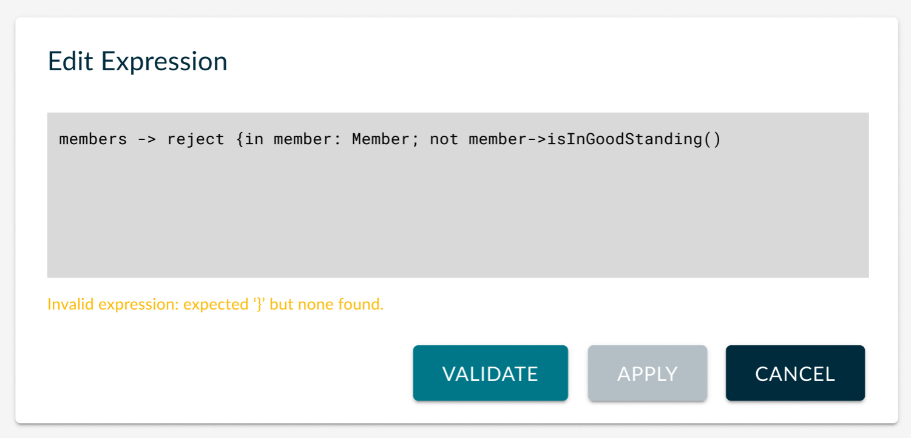

:author: Pierre-Charles David <pierre-charles.david@obeo.fr>
:date: 2026-04-01
:status: proposed
:consulted: Axel Richard <axel.richard@obeo.fr>
:informed: Axel Richard <axel.richard@obeo.fr>
:deciders: Axel Richard <axel.richard@obeo.fr>
:issue: https://github.com/eclipse-syson/syson/issues/2097

= (M) Handle expressions in SysON

== Problem

The SysMLv2 language supports rich _expressions_ that can be used in several places in a model.
The expression sublanguage itself is defined in section 7.4.9 of the KerML specification.

Expressions can appear in several places (non exhaustive list): succession, transition, attribute values, constraints, assumptions, etc.

For example to specify the constraints of a `requirement`:

[source]
----
requirement def MaximumMass {
  attribute massActual : Real;
  attribute massRequired : Real;
  assume constraint { massRequired > 0 } // 'massRequired > 0' is an Expression
  require constraint { massActual <= massRequired } // so is 'massActual <= massRequired'
}
----

Currently SysON has poor support for these:

- the only way to _create_ them is indirectly through the _New object from text_ feature by creating a whole element like `RequirementDefinition` with an `assume constraint` as above or when specifying a `FeatureValue` through direct edit (e.g. `fuelLevel : Real = 42`) on a diagram;
- once created, the expressions are not visible or editable from the corresponding element's _Details_ view (except for `FeatureValue`, where the text representation of the expression is visible, but not editable, on the _Details_ view);
- in the _Explorer_ view expressions are exposed as their raw AST, which make them unsuable by end-users.

== Key Result

Users should be able to _create_, _view_, _edit_ and _remove_ expressions everywhere they can occur inside a model through their natural textual syntax (as defined in KerML §7.4.9).

When a user creates or edits the textual representation of an expression, if the user-specified text is invalid (i.e. it does not parse and/or resolve without errors), the invalid text should neither result in an invalid model nor be lost.

Instead the end-user should be clearly notified that the text is invalid and be given the possibility to edit it until it can be interpreted/parsed as a valid expression.

== Solution

Event though (valid) expressions are stored as modeled ASTs, the natural way for end-users to interact with expressions is through their textual representations (e.g. `totalMass == sum(partMasses)`), so we will make sure that:

* by default expressions are displayed using this representation;
* editing expressions is also done by modifying the text representation.

=== Two approaches to handling invalid expressions

There are two possible approaches for dealing with invalid expressions:

1. **Validate expressions at edit time**: use a dedicated editing UI that validates the expression before accepting it.
Malformed or invalid expressions are _never_ stored in the model.
If the user dismisses the editing UI without having applied a valid expression, the text they entered is lost.

2. **Allow invalid expressions to be stored**: let the user enter invalid expressions, but clearly indicate their status in the UI.
The invalid raw text is stored separately (see <<storing-raw-text>>) to allow the user to correct it at their convenience.

Both options are technically possible.
For the moment, the first one is preferred (validating expressions at edit time), as it ensures the actual SysML model is always kept in a valid state, and it avoids the whole discussion of where and how to store the temporarily invalid user text.

Whichever option is finally chosen, it is crucial to inform the user at all times of the impact of their actions:

* Validating an empty expression results in the *deletion* of the expression.
* If the user closes the editing modal without having "applied" a valid expression, their text is lost.

=== Expression editing UI

Different options have been dicussed in terms of UI to allow users to edit the textual representation of expressions:

1. We could leverage the existing "direct edit" support, at least in the _Explorer_ view and on _diagrams_.
However the UX/workflow of simple direct-edit is too limited and does not fit the requirement above to allow for validation before actually applying a change and keep the user informed about the (in)validity of the text entered.

2. We discussed combining multiple existing widgets inside the _Details_ view, i.e. a group with a `Textfield` for the text itself, label(s) to indicate the validation status, and buttons to _Validate_, _Apply_ and _Clear/Delete_.
However the behavior of the existing `Textfield` widget would not fit the intended workflow, as it will try send it's current text to the backend as soon as it loses focus.
If a user enters some invalid text and then clicks on _Validate_, the `Textfield` would send the invalid text to the backend first, which would reject it, and then re-render the textfield using the previous value in the model.
The handler for the _Validate_ button would never see the invalid text as it only existed temporarily inside the frontend.

3. We could create a custom widget to implement the workflow we want combining raw MUI components to work around the limitations mentioned above.
This would work but requires significant developement effort.
Creating suchg a rich and generic/configurable "source edition widget" could be useful for other cases, and might happen later, but given the appetite for this pitch, this option was rejected for now.

4. We could create a custom UI inside a modal dialog.
It would be very similar to the existing _New object as text_ dialog, but only supporting _expressions_ and following a slighlity different workflow.
Instead of a button to _Create object_ which returns a diagnostic/error report _after the fact_, we would have:
** A text area for the user to edit the expression's text
** A feedback area to show the current status of the expression: _valid_, _invalid_ (with details if possible), _unknown_ (if the user has modified the text since the last validation)
** A _Validate_ button, which will send the current text to the backend for _validation_ only.
It will not actally edit the model/update the expression.
The backend will return a diagnstic, at the very least a valid/invalid status, and if possible details about validation errors.
** An _Apply_ button, which will only be enabled if the current text is valid (i.e. it has been validated and not modified afterwards).
** A _Clear_ or _Delete_ button to actually delete the expression from the model.
Note that setting the expression's text to an empty (or whitespace only) text and applying it will _delete_ the expression from the model.
** A _Cancel_ button to dismiss the modal without any change to the model.

**Decision**: we will implement the custom modal (to be detailed in a coming ADR).

Note that there is a possibility to later update the existing _New object as text_ to use the same dialog/UI, but this is out of scope for this iteration.

It might also be possible later on to convert this custom UI into a more generic and configurable custom widget that could be upstreamed in Sirius Web and used in _Form_ representations.
In this case, the modal(s) in SysON would need to evolve to actually display a _Form_ using this widget, properly configured.
This is not planned at the moment.

=== Behavior per view

==== Explorer view

Nodes representing an `Expression` will display the full serialized textual representation of the expression.
This will match what is already shown on diagrams for e.g. `assume constraint` list items.

Direct edit will be disabled on expressions items in the Explorer.
As mentioned above, the direct edit workflow does not fit the constraing for ensuring expressions validity.
This requires an evolution in Sirius Web to distinguish "editable" from "label-editable" (there may be an existing ticket for this).

Instead, a *custom actions* in these node's context menu will open the dedicated expression editing UI (described above).
The following actions  available:

* **Edit Expression**: available on both the expression element itself and on its parent element (when the expression inside exists).
Opens the dedicated expression editing UI.
* **New Expression**: available on elements which can contain an expression if no such expression exists; creates a new expression and immediately opens the editing UI.
* **Delete Expression**: available on both the expression element and on its parent element (when the expression inside exists).
Removes the expression.

As a bonus, an *explorer filter* might be provided to hide the sub-elements corresponding to the AST details.

==== Details view

A dedicated *"Expression value"* group will be added to the Details view, with the following behavior:

* It displays the textual representation of the expression, generalizing what is already supported for `FeatureValue` (see `SysMLv2PropertiesConfigurer.createFeatureValuePropertiesGroup()`) to all elements which can contain an `Expression`.
The representation is displayed more prominently than currently.
* In addition to the text field itself (which is *not directly editable*), the group provides:
** an *"Edit"* button that opens the dedicated expression editing modal;
** a *"Clear/Delete"* button (with confirmation) to remove the expression.
* The group is visible on both an `Expression` element *and* on its parent element.
* On the parent element, the group is visible even if no expression exists yet.
In that case, the "Edit" button is labeled *"Create & Edit"* and creates the expression upon activation.

==== Diagrams

* For *`FeatureValue`* elements, direct edit support is retained, but the `= ...` portion is removed from the `initialEditText` and from the grammar; setting the value through normal direct edit is no longer supported.
Instead, new palette action(s) are provided to create, edit, and delete an expression.
Multiple actions may be available depending on context (e.g. `FeatureValue` on an attribute vs. other contexts).
* For elements that are "raw" expressions (e.g. `assume constraint`), there is no direct edit.
Only an *"Edit expression"* action is available, which opens the dedicated editing UI.
* *Keyboard shortcuts* (e.g. `Ctrl+E`) can be used to invoke the expression editing UI.

[[storing-raw-text]]
=== Storing raw user-supplied text for invalid expressions

If we decided to take the approach allow invalid expressions to be stored in the model, we need a way to persist the user-supplied text for an expression even if it is currently invalid.

For example if a user enters `totalMass == sum(partMasses` for a constraint (missing closing paren), we can not parse this as a valid model, so instead of creating "garbage" in the model, we will store the raw string `"totalMass == sum(partMasses"`, tell the user about the problem and allow him to edit the string into a valid one.

Two possible options (there might be more) for storing this raw text:

* Use EMF `EAnnotations`, as in SysON, to root type `Element` is also an `ecore.EModelElement`. For example:
[source,java]
----
String userSuppliedText  = "...";
EAnnotation rawExpressionText = EcoreFactory.eINSTANCE.createEAnnotation();
rawExpressionText.setSource("syson");
rawExpressionText.getDetails().put("user-input:expression", userSuppliedText);
element.getEAnnotations().add(rawExpressionText);
----
The issue with this option is that EMF `EAnnotations` rely on EMF `EMap` and it is not clear that Sirius EMF JSON supports these correctly.

* Leverage SysML's notion of _textual representation_ (see § 7.4.3 of the SysML specification) with a custom language (e.g. `"syson:user-input:expression"`) to keep syntacticaly invalid user-supplied text until it is fixed and can be parsed.
This has the benefit over the other option (`EAnnotation`) to only use standard EMF mechanisms, but it is not clear if this is using the SysML _textual representation_ as intended or abusing it, and if it would cause interoperability issues with other SysML tools.

=== Breadboarding

Mockup of the edit expression modal:

=== Cutting backs

- Fine-grained error reporting on syntax or semantic errors in invalid textual representation of the expressions.

== Rabbit holes

- The current Sirius Web text widget may not be powerful enough to give end-user precise feedback in case of invalid expressions.
It is possible to associate diagnostics to a textfield/textarea widget, but https://github.com/eclipse-sirius/sirius-web/issues/4413[only the first one is actually displayed] and only as an unstructured text.
It is not possible for example to highlight the position of specific syntax errors like one would expect in a "smart" editor.

== No-gos

- When the user edits an expression as text, once the expression has been correctly parsed as a valid model, we will no try to retain any original formatting (e.g. whitespace).
