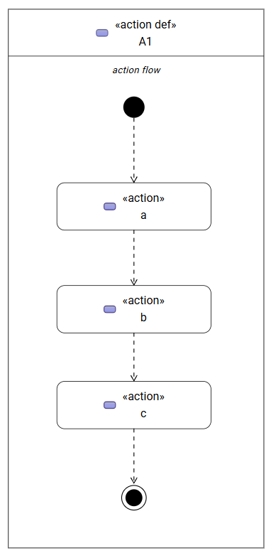
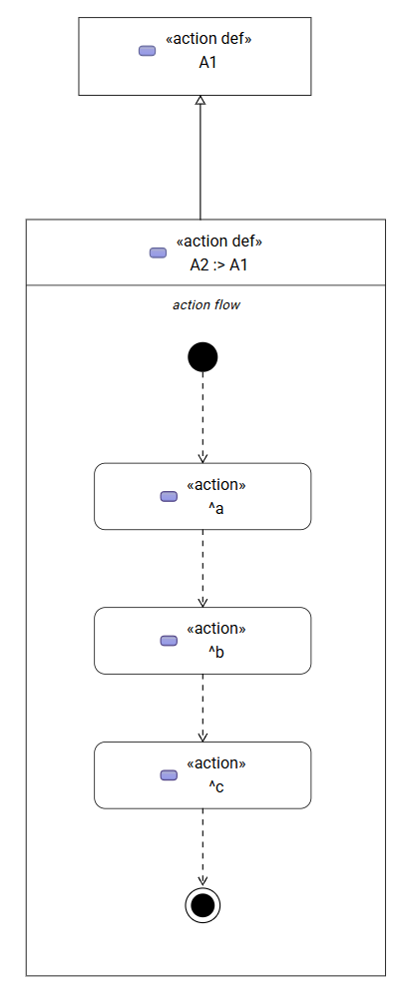
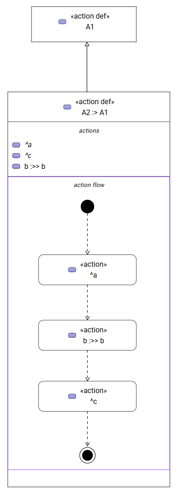
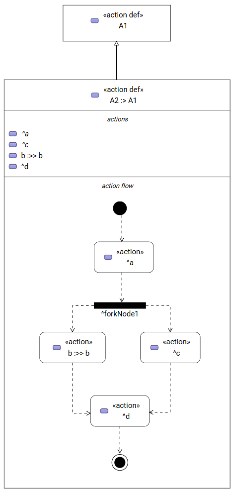

:author: Jérôme Gout <jerome.gout@obeosoft.com>
:date: 2026-08-14
:status: proposed
:consulted: Axel Richard <axel.richard@obeo.fr>
:informed: Axel Richard <axel.richard@obeo.fr>
:deciders: Axel Richard <axel.richard@obeo.fr>
:issue:

= (M) Add support of inheritance of free form compartments content

== Problem Statement

For simplicity, the remainder of this document will focus exclusively on the _action flow_ compartment of actions.
Nevertheless, there are also the _state transition_ and the _interconnection_ compartments that should be also be covered by the implementation.
The proposed solution should therefore be designed to support these compartments as well, even though the _action flow_ compartment is by far the most complex.

SysML v2 `ActionDefinition` and `ActionUsage` elements can be decomposed into sub-actions that describe the behavior of the containing action. The ordering and sequencing of these sub-actions can be expressed using `Succession` relationships, together with control nodes such as `Fork`, `Join`, `Decision`, and `Merge`, as well as the `start` and `done` actions provided by the Actions library.

In SysON, this behavioral decomposition is visually represented in the **_action flow_** compartment of an `ActionDefinition` or `ActionUsage`. The compartment displays the sub-actions and the control flow between them, providing a graphical representation of the action's behavior.

However, the content of _action flow_ compartments currently does not support specializations. When an action is specialized, the graphical representation of its _action flow_ does not take into account the sub-actions and flow elements inherited from the specialized action.

For example, consider an `ActionDefinition` `A1` that defines a sequence of sub-actions:

```
action def A1 {
    action a;
    action b;
    action c;

    first start then a;
    then b;
    then c;
    then done;
}
```

An `ActionDefinition` `A2` can specialize `A1`:

```
action def A2 :> A1 {
}
```

According to the current SysON behavior, the _action flow_ compartment of `A2` does not display the inherited sub-actions or their sequencing. Consequently, although `A2` semantically specializes `A1` and inherits its action structure, this inherited behavior is not reflected in the graphical representation.

The same issue applies when specializations affect nested `ActionUsage` elements within an `ActionDefinition` or `ActionUsage`. The _action flow_ compartment currently represents only the elements directly declared in the context being displayed and does not account for the elements made available through specialization.

The purpose of this feature is therefore to extend the _action flow_ compartment so that the graphical representation reflects the action structure resulting from SysML v2 specialization, including inherited sub-actions and their associated flow relationships.

== Expected Result

The _action flow_ compartment should represent the effective action flow resulting from the specialization of an `ActionDefinition` or `ActionUsage`. In other words, the graphical representation should not be limited to elements directly declared by the displayed action: it should also take into account the action usages and flow relationships inherited through specialization.

This behavior is consistent with the SysML v2 language model. In section *7.17.1, “Actions Overview”*, the specification states that the features of an `ActionDefinition` or `ActionUsage` that are themselves `ActionUsage` s specify the performance of the containing action in terms of its sub-actions. The specification further states that action definitions and usages can be decomposed into lower-level action usages to create an action tree, and that an `ActionDefinition` can be subclassified while an `ActionUsage` can be subsetted or redefined.

This is reflected in the normative metamodel presented in section *8.3.17, “Action Definition and Usage” (Figure 23)*. `ActionDefinition::action` is defined as an ordered collection of `ActionUsage`s that subsets `step` and `usage`, representing the action usages that are steps of the action definition. The same figure also shows `ActionUsage::nestedAction` as the collection of nested action usages, which subsets `nestedOccurrence`.

For example, consider the following definition:

```
action def A1 {
    action a;
    action b;
    action c;

    first start then a;
    then b;
    then c;
    then done;
}
```

The _action flow_ compartment of `A1` should therefore represent:



If another action definition specializes `A1`:

```
action def A2 :> A1 {
}
```

the _action flow_ compartment of `A2` should represent the flow inherited from `A1`:


The purpose is not to duplicate the model elements in `A2`, but to provide a graphical representation of the action structure that is effective in the context of `A2`.

=== Specialization of nested actions

The same principle must apply when a nested action is redefined in the specialized action.

For example:

```
action def A1 {
    action a : A;
    action b : B;
    action c : C;

    first start then a;
    then b;
    then c;
    then done;
}

action def A2 :> A1 {
    action b : B2 redefines A1::b;
}
```

The _action flow_ compartment of `A2` should represent the inherited flow while resolving the redefined action in the context of `A2`:



The graphical representation should therefore preserve the flow defined by `A1`, while displaying the effective specialized action usages where they have been redefined.

This behavior is consistent with the SysML v2 language model. In section *7.17.1, “Actions Overview”*, the specification states that:

[quote]
----
In addition, an action definition can be subclassified, and an action usage can be subsetted or redefined. This provides enhanced flexibility to modify a hierarchy of action usages to adapt to its context.
----
This is reflected in the normative metamodel presented in section *8.3.17, “Action Definition and Usage”* (Figure 23). ActionUsage::actionDefinition identifies the Behavior definitions of which the action usage is a usage and is shown as a redefinition of both behavior and occurrenceDefinition. Consequently, an ActionUsage can specialize or redefine an inherited action usage while remaining part of the behavioral structure defined by its containing action.
=== Inherited control flow

The _action flow_ compartment should also preserve control-flow elements that are part of the inherited action flow, including `Succession` relationships and control nodes such as `Fork`, `Join`, `Decision`, and `Merge`.

For example:

```
action def A1 {
    action a;
    action b : B2 redefines A1::b;
    action c;
    action d;

    first start then a;
    then fork;
    fork then b;
    fork then c;
    join then d;
    then done;
}
```

A specialization without any behavioral modification:

```
action def A2 :> A1 {
}
```

should display the same effective flow:



The specialization should therefore not cause the inherited control-flow structure to disappear simply because the corresponding elements are not directly owned by `A2`.

=== Expected behavior

The implementation should consequently make the _action flow_ compartment reflect the **effective inherited and specialized action flow** of the displayed element.

In particular:

* sub-actions inherited through specialization must be displayed;
* inherited `Succession` relationships must be represented;
* inherited control nodes must be represented;
* `start` and `done` must continue to be represented as part of the action flow;
* when a nested action is redefined, the graphical representation must display the effective redefining action rather than treating the inherited and redefining usages as unrelated elements;
* adding or redefining elements in a specialized action must update the displayed flow accordingly;
* the implementation must preserve the distinction between inherited model elements and elements actually owned by the specialized action.

The expected result is therefore that the action flow compartment represents the effective action behavior in the context of the displayed action definition.
This includes the action usages and control-flow elements inherited from its general action, while applying any specializations or redefinitions introduced by the current action definition.
The compartment should therefore not be limited to elements directly owned by the displayed action definition.

This ensures that the graphical representation remains consistent with the SysML v2 semantics.
A specialization refines the action structure established by its general action; it does not define an independent action flow disconnected from that inherited structure.
Consequently, when an action definition is specialized, its inherited flow remains part of the effective behavior and must be represented accordingly, with redefined elements resolved in the current specialization context.

== Solution

Handling the complete problem, described in previous sections is beyond the scope of the initial implementation.
In particular, replacing a sub-element inherited from a general element with its redefined element in the specialized flow requires resolving and updating the corresponding relations, since these elements define the edges between nodes in the graphical representation.

Therefore, as a first step, the implementation will support the display of the inherited flow, but will not yet resolve redefinitions of sub-element within that flow.
It will not consider the redefinition of edges connecting _inherited_ nodes in the free form compartments.
For example, if `A2` contains a redefinition of `b` from A1 (`b :>> b` in `A2`), the action flow displayed for `A2` will initially retain the inherited `b` rather than replacing it with `A2::b`.

Support for this case will be addressed as a subsequent enhancement.

=== Nodes

The natural way to approach free form inheritance could be to adapt what has been implemented to handle element inheritance in compartment list.
This means that we have to introduce new _inherited_ graphical nodes to visually represent the inherited parts of the base element inside the sub-node free form compartment.

Unlike the list compartment, the free form compartment is not restricted to a single child node description.
This implies to have multiple _inherited_ mapping definitions for each kind of node that can be found in the compartment.
For instance, as far as _action flow_ compartment is concerned, it can contain:

* `ActionUsage` nodes,
* `AcceptActionUsage` nodes
* `AssignmentActionUsage` nodes
* `PerformActionUsage` nodes
* control nodes (such as `Decision`, `Fork`, `Join`, and `Merge`)
* `StartAction` node
* `DoneAction` node

The `StartAction` and `DoneAction` are already inherited from the standard `Action` from the Sysml library.
Therefore, they won't be considered by free form compartment inheritance mechanism.

A given free form compartment (let's say _action flow_) of a given element (`ActionUsage` for instance) should reuse all node descriptions necessary to display its inherited elements.
That means that for each child node description, we should add an _inherited_ equivalent.
Like for list compartments, _inherited_ node descriptions have a special semantic candidate expression to retrieve semantic elements through inheritance tree.
The visible name of these nodes should be modified (with the ^) to reflect that is an inherited element.
We need also to ensure that these node descriptions are able to handle border nodes that could be visible on the base-element.
For instance, if the `A1::a` of the previous example has an item or a parameter (visible as border nodes of action in the _action flow_ compartment), this border node should be inherited as well inside the _action flow_ of `A2` (on the `^a` action).

A technical approach might be to inherit from `UsageNodeDescriptionProvider` (and `DefinitionNodeDescriptionProvider` for definitions) to create the new class responsible to handle inherited usages overwriting some part to adapt them.

=== Edges

As far as edges are concerned, we need to inherit base-element edges like we inherit nodes.
We need to apply the same approach for edges, define _inherited_ edge descriptions that map regular edge descriptions.
For instance, the `Succession` edge between two regular actions in an _action flow_ compartment should have an equivalent for connecting associated inherited actions.
The _inherited_ edge descriptions (for instance inherited Succession edge description) should be defined a way that source and target nodes are only one of the _inherited_ node descriptions.

In terms of reconnection capabilities, those _inherited_ edges *cannot* be modified since they are only in place to reflect the flow that is inherited since, such relations do not belong to the inherited element.

== Cutting backs

(Nice to have) As we have said, `StartAction` or `DoneAction` are not to consider since they are already part of each action element (via implicit inheritance of `Actions::Action::start` and `Actions::Action::done`).
In _action flow_ compartment (the same consideration applies to state transitions), if there is a `StartAction` or a `DoneAction` that are connected to elements inside the compartment, then we need to add the corresponding `StartAction` or `DoneAction` to the inherited compartment to make the inherited connections visible.

== No-gos
